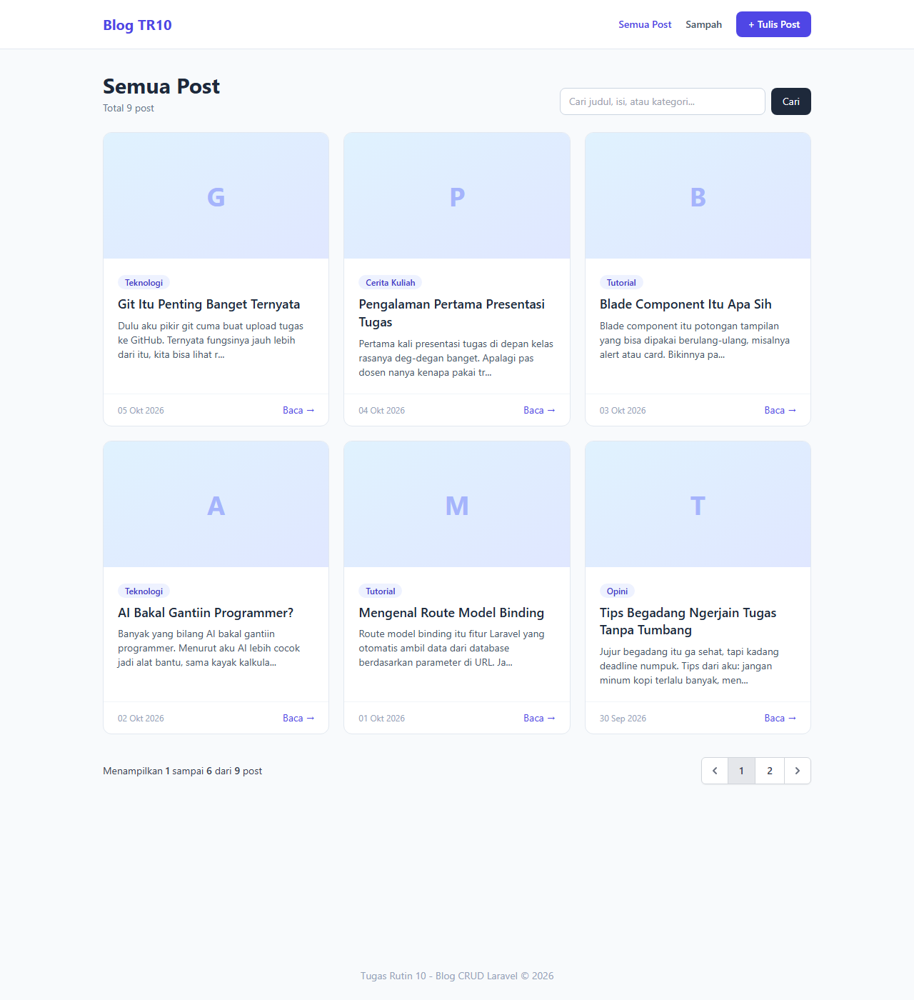
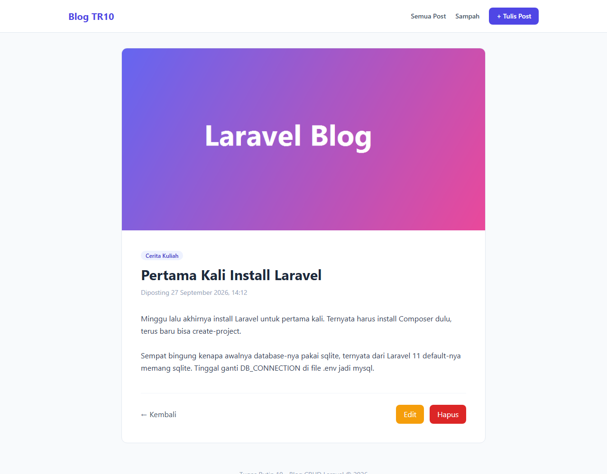
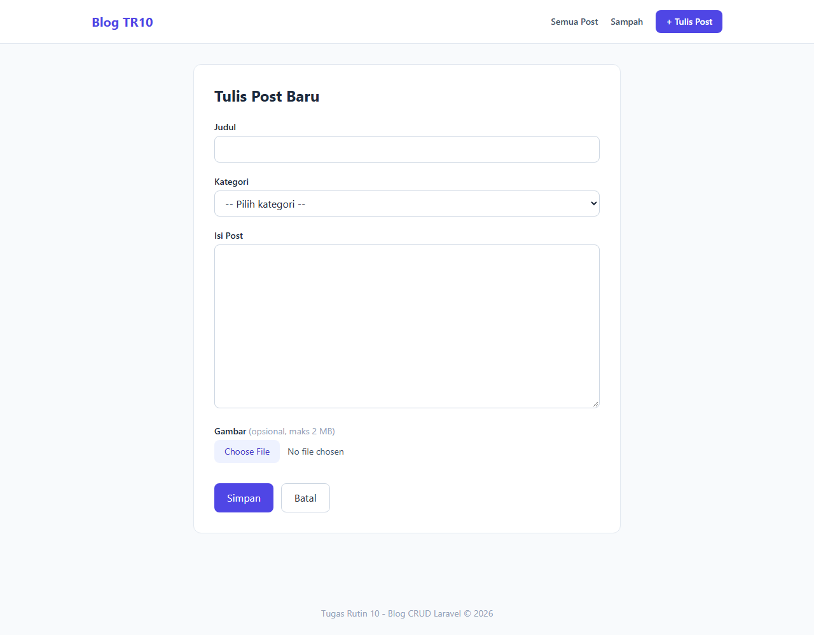
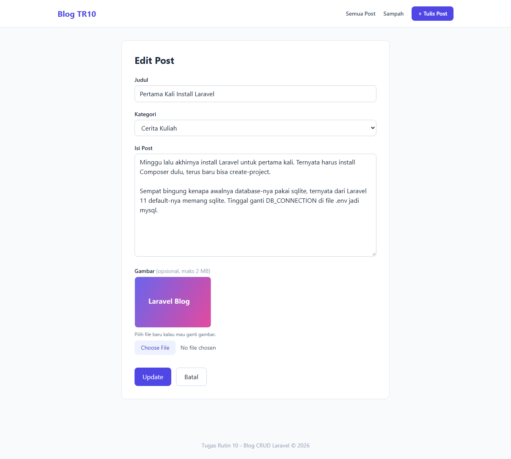
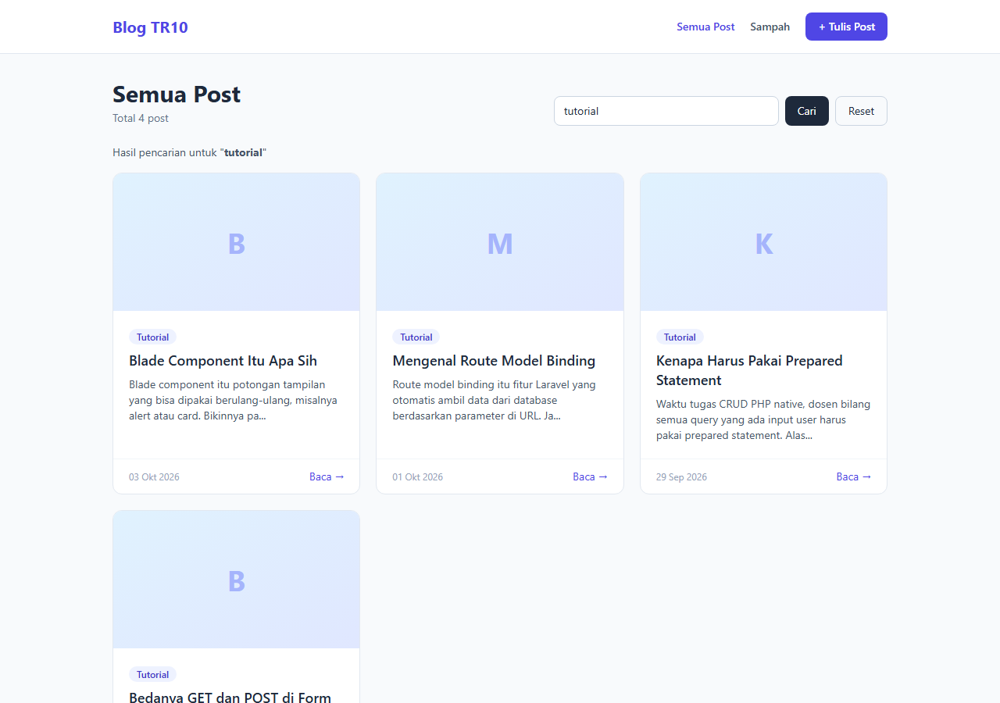
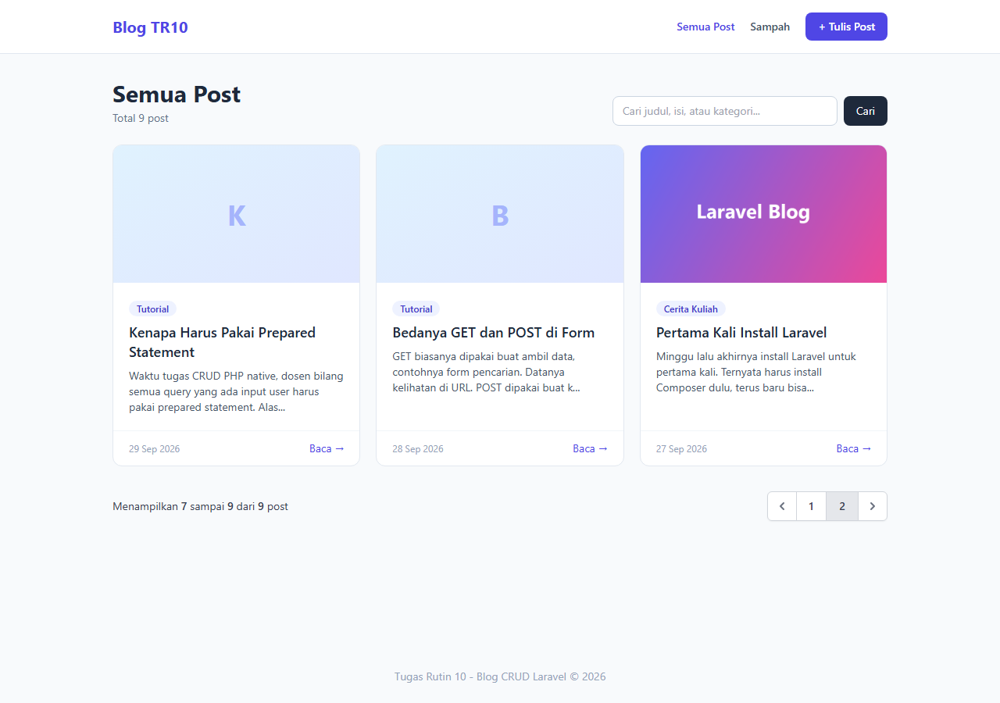
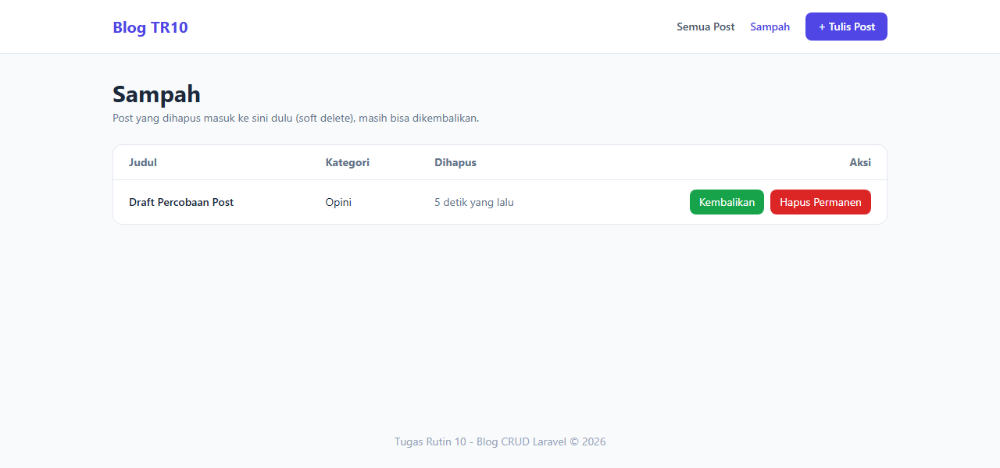

# TugasWeb-P10-BlogCRUD

Tugas Rutin 10 - Blog CRUD pakai Laravel. Bisa tambah, lihat, edit, dan hapus post, plus pencarian, soft delete (ada halaman sampah), dan upload gambar.

- Laravel 12
- PHP 8.2 + MySQL (XAMPP)
- Tailwind CSS (CDN)

## Screenshot

| Daftar Post | Detail Post |
|---|---|
|  |  |

| Tulis Post | Edit Post |
|---|---|
|  |  |

| Pencarian | Pagination |
|---|---|
|  |  |

| Sampah (soft delete) |
|---|
|  |

## Fitur

| No | Requirement | Keterangan |
|---|---|---|
| 1 | `Route::resource('posts')` + named routes | `routes/web.php`, semua link pakai `route('posts.xxx')` |
| 2 | PostController resource (7 method) | `index`, `create`, `store`, `show`, `edit`, `update`, `destroy` |
| 3 | Blade layout master | `layouts/app.blade.php`, view lain pakai `@extends` + `@yield('content')` |
| 4 | Component | `<x-alert>` dan `<x-card>` (`app/View/Components`) |
| 5 | Validasi + error per field + old input | `StorePostRequest` / `UpdatePostRequest`, `@error` dan `old()` di form |
| 6 | Flash message sukses/gagal | `session('success')` / `session('error')` ditampilkan pakai `<x-alert>` |
| 7 | `@csrf` + `@method` | Semua form pakai `@csrf`, edit pakai `@method('PUT')`, hapus pakai `@method('DELETE')` |
| 8 | Route Model Binding + pagination | `show(Post $post)` dll, `paginate(6)` |

Bonus:
- **Pencarian** berdasarkan judul, isi, atau kategori (`?q=...`), keyword tetap kebawa waktu pindah halaman
- **Soft delete**, post yang dihapus masuk ke halaman Sampah, bisa dikembalikan atau dihapus permanen
- **Upload gambar** (jpg/png/webp maks 2 MB), gambar lama otomatis dihapus kalau diganti

## Cara Install

1. Clone repo
   ```bash
   git clone https://github.com/graceyla/TugasWeb-P10-BlogCRUD.git
   cd TugasWeb-P10-BlogCRUD
   ```
2. Install package
   ```bash
   composer install
   ```
3. Copy `.env` dan generate key
   ```bash
   copy .env.example .env
   php artisan key:generate
   ```
4. Buat database `db_tr10_blog` di phpMyAdmin, lalu cek `.env`:
   ```env
   DB_CONNECTION=mysql
   DB_DATABASE=db_tr10_blog
   DB_USERNAME=root
   DB_PASSWORD=
   ```
5. Migrate + isi data contoh
   ```bash
   php artisan migrate --seed
   ```
6. Buat link storage supaya gambar upload bisa diakses
   ```bash
   php artisan storage:link
   ```
7. Jalankan
   ```bash
   php artisan serve
   ```
   Buka `http://127.0.0.1:8000`

## Route

| Method | URL | Nama | Fungsi |
|---|---|---|---|
| GET | `/posts` | posts.index | Daftar post + pencarian |
| GET | `/posts/create` | posts.create | Form tulis post |
| POST | `/posts` | posts.store | Simpan post baru |
| GET | `/posts/{post}` | posts.show | Detail post |
| GET | `/posts/{post}/edit` | posts.edit | Form edit |
| PUT/PATCH | `/posts/{post}` | posts.update | Update post |
| DELETE | `/posts/{post}` | posts.destroy | Hapus (soft delete) |
| GET | `/posts/trash` | posts.trash | Halaman sampah |
| PATCH | `/posts/{post}/restore` | posts.restore | Kembalikan post |
| DELETE | `/posts/{post}/force` | posts.force-delete | Hapus permanen |

## Artisan yang dipakai

```bash
php artisan make:model Post -mf
php artisan make:controller PostController --resource --model=Post
php artisan make:request StorePostRequest
php artisan make:request UpdatePostRequest
php artisan make:component Alert
php artisan make:component Card
php artisan make:seeder PostSeeder
```

## Struktur Folder Penting

```
app/
├── Http/
│   ├── Controllers/PostController.php   -> logic CRUD
│   └── Requests/
│       ├── StorePostRequest.php         -> aturan validasi
│       └── UpdatePostRequest.php
├── Models/Post.php                      -> model + SoftDeletes + scope search
└── View/Components/
    ├── Alert.php
    └── Card.php
database/
├── migrations/..._create_posts_table.php
└── seeders/PostSeeder.php               -> 9 contoh post
resources/views/
├── layouts/app.blade.php                -> layout master
├── components/
│   ├── alert.blade.php
│   └── card.blade.php
└── posts/
    ├── index.blade.php
    ├── create.blade.php
    ├── edit.blade.php
    ├── _form.blade.php                  -> form yang dipakai bareng create & edit
    ├── show.blade.php
    └── trash.blade.php
routes/web.php
```
